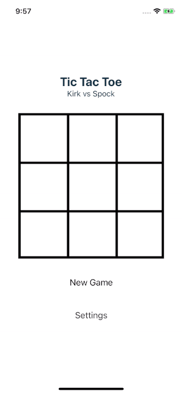

# TicTacToe

A simple two player tictactoe app built using React Native

To run the app using local expo serve

git clone https://github.com/rameshdhas/tictactoe.git

cd tictactoe

npm install

expo start

This will launch a development server in localhost:19002, with the message Tunnel ready. 

Click iOS simulator in the webpage which will launch the app in ios simulator.

